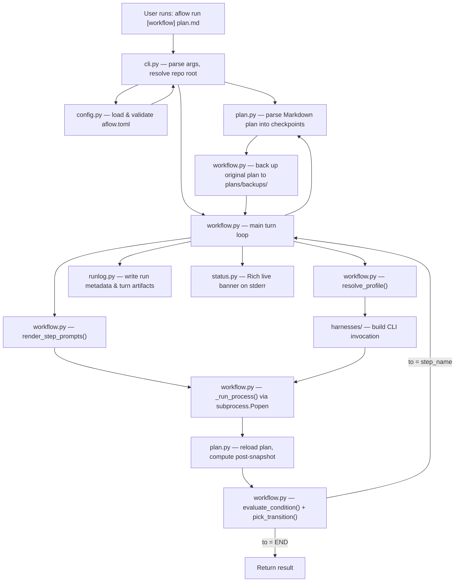

# Architecture

AFlow is a plan-driven workflow orchestrator that runs coding tasks through existing AI agent CLIs (Claude, Codex, Gemini, Kiro, OpenCode, Pi). It reads a checkpoint-based Markdown plan, dispatches steps to configurable harness profiles, evaluates condition-based transitions between steps, and logs every turn to disk.

## High-Level Data Flow



## Module Breakdown

### `cli.py`
Entry point. Exposes two subcommands:
- **`aflow run [workflow_name] plan.md [-- extra instructions]`** -- runs a workflow.
- **`aflow run [workflow_name] --start-step STEP_NAME plan.md [-- extra instructions]`** -- starts a workflow from a named step.
- **`aflow install-skills [destination]`** -- copies bundled skills into harness skill directories.

Resolves the repo root via `git rev-parse`, loads and validates the TOML config, resolves the selected workflow, and handles startup step selection or recovery before calling `run_workflow()`.

Startup resolution happens in `main()` before the workflow loop starts:

1. Resolve config and workflow.
2. Load the original plan strictly.
3. If the plan is complete and `--start-step` was given, fail with a clear error.
4. If the plan is half-done and the workflow has more than one step, require a TTY and prompt for an explicit step unless `--start-step` was given.
5. If strict plan loading fails with `inconsistent_checkpoint_state`, require a TTY and ask whether to recover.
6. When recovery is accepted, load a tolerant snapshot from the invalid plan, seed startup retry state, and pass both the parsed plan and retry context into `run_workflow()`.

### `config.py`
Loads `~/.config/aflow/aflow.toml` (bootstrapped from the bundled default on first run). Parses and validates:
- **`[aflow]`** section: `default_workflow`, `keep_runs`, `retry_inconsistent_checkpoint_state`, `max_same_step_turns`.
- **`[harness.<name>.profiles.<profile>]`** tables: `model`, `effort` per harness profile.
- **`[workflow.<name>]`** table: optional `retry_inconsistent_checkpoint_state` override that takes precedence over the `[aflow]` global when set.
- **`[workflow.<name>.steps.<step>]`** tables: `profile` (harness.profile selector), `prompts` (list of prompt keys), `go` (transition array with `to` and optional `when` condition).
- **`[prompts]`** section: named prompt templates.

Cross-validates that profiles, prompts, and transition targets all reference things that exist.

### `plan.py`
Parses a Markdown plan file into structured checkpoint data. Expects `### [x] Checkpoint ...` headings (h3 with checkbox) and `- [ ] step` items underneath. Produces a `PlanSnapshot` with:
- `current_checkpoint_name`, `current_checkpoint_index`
- `unchecked_checkpoint_count`, `current_checkpoint_unchecked_step_count`
- `is_complete` (all checkpoints checked)
- `total_checkpoint_count`

Also detects `## Git Tracking` sections required by review skills.

### `workflow.py`
The core engine. `run_workflow()` executes the turn loop:

1. Back up the original plan to `plans/backups/`.
2. Parse the plan unless `main()` already provided a pre-loaded `ParsedPlan`.
3. For each turn (up to `max_turns`):
   a. Reload the plan from disk (the agent may have modified it).
   b. Resolve the step's harness profile to get model/effort settings.
   c. Render prompt templates with path placeholders (`{ORIGINAL_PLAN_PATH}`, `{NEW_PLAN_PATH}`, `{ACTIVE_PLAN_PATH}`).
   d. Build a `HarnessInvocation` via the adapter.
   e. Run the agent CLI as a subprocess, streaming stdout/stderr.
   f. Before reloading the plan, scan stdout and stderr for a line starting with `AFLOW_STOP:`. If found, fail the run immediately with the extracted reason without entering the plan-reload or transition path.
   g. Reload the plan again to get the post-turn snapshot. If the plan is left in an inconsistent checkpoint state (heading marked complete but unchecked steps remain) and the harness exited cleanly, a retry may be scheduled instead of failing immediately (see `retry_inconsistent_checkpoint_state`).
   h. Evaluate `go` transitions using condition symbols (`DONE`, `NEW_PLAN_EXISTS`, `MAX_TURNS_REACHED`).
   i. Log turn artifacts and update run metadata.
   j. If transition target is `END`, return. For multi-step workflows, check the same-step cap: if the same step has been selected consecutively `max_same_step_turns` times, fail the run before starting the next turn. Otherwise, advance to the next step.

A scheduled retry skips the pre-turn plan reload and reuses the last valid snapshot and saved prompt context. The same `ACTIVE_PLAN_PATH`, `NEW_PLAN_PATH`, and step selector are reused; the retry appendix (containing the exact parse error) is added to the prompt. Startup recovery seeds that same retry machinery by passing a `RetryContext` into `run_workflow()`, which stores it in `state.pending_retry` before turn 1. Retry turns still count toward `max_turns`.

The condition evaluator is a full recursive-descent parser supporting `&&`, `||`, `!`, and parentheses over the three condition symbols.

Prompt templates support `file://` references (absolute, config-relative, or cwd-relative).

### `harnesses/`
Adapter layer. Each harness implements `HarnessAdapter.build_invocation()` to produce a `HarnessInvocation` (argv, env, prompt texts). Six adapters:

| Harness    | CLI binary  | Prompt mode                    | Effort support |
|------------|-------------|--------------------------------|----------------|
| `claude`   | `claude`    | `--system-prompt` flag         | Yes            |
| `codex`    | `codex`     | system prefixed into user prompt | Yes          |
| `gemini`   | `gemini`    | system prefixed into user prompt | No           |
| `kiro`     | `kiro-cli`  | system prefixed into user prompt | No           |
| `opencode` | `opencode`  | system prefixed into user prompt | No           |
| `pi`       | `pi`        | `--system-prompt` flag         | Yes            |

All harnesses run in non-interactive, auto-approve mode with full tool access.

### `run_state.py`
Data classes for runtime state:
- `ControllerConfig` -- immutable run parameters (repo root, plan path, max turns, keep runs, extra instructions).
- `ControllerState` -- mutable per-run state (snapshot, turn count, issues, timing, status, pending retry context, consecutive same-step streak tracking).
- `RetryContext` -- frozen dataclass holding everything needed to rerun the same step on the next turn without re-parsing the broken plan (step name, profile, resolved harness/model/effort, pre-failure snapshot, saved plan paths, base prompt, parse error string, attempt counter, retry limit).
- `ControllerConfig` also carries the selected startup step, if any, so the workflow loop can start from a non-default step without re-parsing CLI arguments.
- `ControllerRunResult` -- final result with end reason.
- `WorkflowEndReason` -- literal type: `already_complete`, `done`, `max_turns_reached`, `transition_end`.

### `runlog.py`
Persists run data under `.aflow/runs/<timestamp>-<uuid>/`:
- `run.json` -- run-level metadata, updated after each turn.
- `turns/turn-NNN/` -- per-turn artifacts: `system-prompt.txt`, `user-prompt.txt`, `effective-prompt.txt`, `argv.json`, `env.json`, `stdout.txt`, `stderr.txt`, `result.json`.

Prunes old run directories to respect `keep_runs`.

### `git_status.py`
Git snapshot helpers used by the banner and CLI. Provides three public data classes (`GitBaseline`, `GitSummary`, `WorktreeProbe`) and three functions:
- `probe_worktree(repo_root)` — checks whether the working tree is dirty at startup.
- `capture_baseline(repo_root)` — snapshots the current HEAD SHA and a working-tree tree OID (using a temporary `GIT_INDEX_FILE`) as a before-run baseline.
- `summarize_since_baseline(repo_root, baseline)` — compares the current working tree against the baseline and returns file-change counts, net line deltas, commit count, and changed paths.

All three functions return `None` when git is unavailable or fails, so the workflow always runs regardless of git state.

### `status.py`
Rich-based live banner rendered to stderr during a run. Shows elapsed time, workflow/step name, harness, model, checkpoint progress, turn count, issues, plan paths, git summary (if available), and status.

`BannerRenderer` owns a background daemon thread that rebuilds and pushes the panel every `refresh_interval_seconds` (default 1 s) and polls for a new `GitSummary` every `git_poll_interval_seconds` (default 10 s). This keeps the elapsed timer alive between step transitions without requiring external pushes. `set_context(...)` is used to update mutable banner fields instead of directly writing private attributes.

### `skill_installer.py`
Discovers the six bundled skills from package resources and copies them into harness-specific skill directories. Supports auto-detection (looks for harness CLIs on PATH) and manual mode (explicit destination path). Handles duplicate destinations when multiple harnesses share a path (e.g., gemini and pi both use `~/.agents/skills`).

### `bundled_skills/`
Six Markdown-based skill definitions installed into harness skill directories:

| Skill                       | Purpose                                                        |
|-----------------------------|----------------------------------------------------------------|
| `aflow-plan`                | Create a checkpoint handoff plan                               |
| `aflow-execute-plan`        | Execute an entire plan autonomously, checkpoint by checkpoint  |
| `aflow-execute-checkpoint`  | Execute exactly one checkpoint, then stop                      |
| `aflow-review-squash`       | Review completed work; approve+squash or create fix plan       |
| `aflow-review-checkpoint`   | Review one checkpoint; approve or create fix plan              |
| `aflow-review-final`        | Final review without squash; approve or create follow-up plan  |

## Workflow Configuration

Workflows are state machines defined in TOML. Each step has:
- A `profile` (e.g., `opencode.turbo`) selecting harness + model + effort.
- A `prompts` list referencing named prompt templates.
- A `go` array of transitions, each with a `to` target (step name or `END`) and an optional `when` condition expression.

Transitions are evaluated top-to-bottom; the first match wins. An entry without `when` is an unconditional fallback.

The built-in workflow diagrams live in the README so the default workflow shapes are visible in the main docs without sending readers into the architecture reference first.

## Directory Layout

```
aflow/
  __main__.py          # entrypoint
  cli.py               # argument parsing, main(), dirty-worktree gate
  config.py            # TOML config loading and validation
  plan.py              # Markdown plan parser
  workflow.py          # workflow engine (turn loop, conditions, transitions)
  run_state.py         # runtime data classes
  runlog.py            # run/turn artifact persistence
  status.py            # Rich live banner with background refresh thread
  git_status.py        # git snapshot helpers (probe, baseline, summary)
  skill_installer.py   # bundled skill installer
  aflow.toml           # default config (bootstrapped on first run)
  harnesses/
    __init__.py        # adapter registry (ADAPTERS dict)
    base.py            # HarnessAdapter protocol, HarnessInvocation dataclass
    claude.py          # Claude Code adapter
    codex.py           # Codex adapter
    gemini.py          # Gemini adapter
    kiro.py            # Kiro adapter
    opencode.py        # OpenCode adapter
    pi.py              # Pi adapter
  bundled_skills/
    aflow-plan/              SKILL.md
    aflow-execute-plan/      SKILL.md
    aflow-execute-checkpoint/ SKILL.md
    aflow-review-squash/     SKILL.md
    aflow-review-checkpoint/ SKILL.md
    aflow-review-final/      SKILL.md
tests/
  test_aflow.py        # workflow engine tests
  test_skill_install.py # skill installer tests
plans/                 # user plan files and backups
  backups/             # automatic plan backups
  in-progress/         # active handoff plans
.aflow/
  runs/                # per-run logs (gitignored)
```

## Key Design Decisions

- **Plan as source of truth.** The Markdown plan file on disk is authoritative. The engine re-reads it before and after every turn because the agent subprocess may modify it (checking off steps/checkpoints).
- **Harness-agnostic.** The engine doesn't know how any specific agent CLI works. Adapters translate a uniform interface into CLI-specific argv/env. Adding a new harness means one ~30-line adapter file.
- **Interactive startup decisions live in the CLI.** Step picking and startup recovery happen before `run_workflow()` so the workflow loop only deals with an already-chosen step and, when needed, a seeded retry context.
- **Condition-based transitions.** Step transitions use a small expression language over three boolean symbols rather than hardcoded control flow. This keeps workflow definitions declarative.
- **Structured run logging.** Every turn's prompts, outputs, and snapshots are persisted to `.aflow/runs/` for debugging and auditability. Old runs are pruned automatically.
- **Skills as Markdown.** The six bundled skills are plain SKILL.md files that get copied into each harness's skill directory. They contain behavioral instructions that the agent reads at runtime, not executable code.
