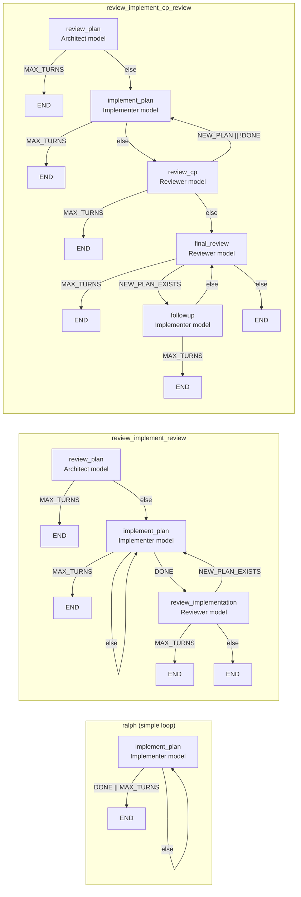

# aworkflow

`aflow` is a workflow engine that runs plan-driven coding workflows through existing agent CLIs such as Codex, Claude, Gemini, Kiro, OpenCode, Copilot and Pi.

It does not call provider APIs directly. It shells out to the harnesses you already use. The main use case is a stricter loop where a stronger model plans or reviews, a fast cheap model implements the current checkpoint, and the run keeps moving until the original plan is done or reaches `END`.

## Why?

I kept wanting two things. First, a clean, repeatable way to make a detailed plan with a capable model, implement the current checkpoint with a fast cheap model, review it, and sometimes improve the plan again with a stronger model. I was doing that manually, so I wanted to automate it.

Second, I don't want to stick to a single provider harness. The best value keeps changing, and a lot of free or included usage is tied to the provider CLI, not an API budget. `aflow` is a reliable wrapper for that workflow.


## Install

Requires Python `3.11+`.

Install with `uv`:

```bash
uv tool install aworkflow
```

That installs the `aworkflow` package and exposes the `aflow` and `aworkflow` commands on your `PATH`.

If you are working from a local checkout, you can also run:

```bash
uv run python -m aflow run path/to/plan.md
```

## Install Skills

`aflow install-skills` copies the eight default bundled skills into harness skill directories. The optional `aflow-assistant` skill is not installed unless you ask for it.

`aflow-assistant` is for setup help, aflow concepts, and evidence-first run debugging.

Auto mode:

```bash
aflow install-skills
```

Manual mode:

```bash
aflow install-skills ~/.claude/skills
```

The auto-install destination map is:

- `codex` -> `~/.agents/skills`
- `copilot` -> `~/.agents/skills`
- `gemini` -> `~/.agents/skills`
- `pi` -> `~/.agents/skills`
- `kiro` -> `~/.kiro/skills`
- `opencode` -> `~/.config/opencode/skills`
- `claude` -> `~/.claude/skills`

Selection flags:

- `--include-optional` installs the default bundled skills plus the optional bundled skills, including `aflow-assistant`
- `--only SKILL` installs exactly the named skill(s), can be repeated, and does not include the default set unless you name it explicitly

## Library API

You can also use `aflow` as a Python library instead of invoking the CLI. The public API is available under `aflow.api` and re-exported from the top-level `aflow` package for stable imports.

Startup preparation returns either a `PreparedRun` (ready to execute) or a `StartupQuestion` (needs user input):

```python
from pathlib import Path
from aflow import (
    StartupRequest,
    StartupQuestion,
    prepare_startup,
    prepare_startup_with_answer,
    execute_workflow,
)

request = StartupRequest(
    repo_root=Path("."),
    plan_path=Path("plans/my-plan.md"),
    workflow_name="ralph",
    start_step=None,
)

result = prepare_startup(request)

if isinstance(result, StartupQuestion):
    # Handle the question (render a prompt, collect user input, then resume)
    answer = input(f"{result.message}: ")
    result = prepare_startup_with_answer(request, answer)

# Now result is a PreparedRun
run_result = execute_workflow(result)
print(f"Run completed: {run_result.end_reason}")
```

For more control over execution, use `WorkflowRunner` with a custom observer:

```python
from aflow import WorkflowRunner, RunnerConfig, CallbackObserver, ExecutionEvent

def my_observer(event: ExecutionEvent) -> None:
    print(f"Event: {event.event_type}")

config = RunnerConfig(
    prepared_run=result,
    observer=CallbackObserver(my_observer),
)

runner = WorkflowRunner(config)
run_result = runner.run()
```

When startup preparation returns a `StartupQuestion`, the caller decides how to present it. The CLI renders questions as TTY prompts; non-CLI callers can present them in any UI or answer programmatically through `prepare_startup_with_answer()`.

See `ARCHITECTURE.md` for full API documentation including all event types, observer implementations, and model definitions.

## Analyze

`aflow analyze` is the supported analyzer entrypoint for run logs under `.aflow/runs/`.

```bash
aflow analyze <RUN_ID>
aflow analyze --repo-root path/to/repo <RUN_ID>
aflow analyze
aflow analyze --repo-root path/to/repo
aflow analyze --all
```

Resolution order for a single run is explicit `RUN_ID`, then the current shell's `.aflow/last_run_ids/<shell-id>` entry when available, then `AFLOW_LAST_RUN_ID`, then `.aflow/last_run_id`.
`--all` switches to corpus mode instead of a single run.

## Usage

Positional forms (backward-compatible):

```bash
aflow run path/to/plan.md
aflow run workflow_name path/to/plan.md
aflow run path/to/plan.md workflow_name
aflow run --start-step implement_plan path/to/plan.md
aflow run -ss 2 path/to/plan.md
aflow run --team 7teen path/to/plan.md
aflow run -mt 10 path/to/plan.md
aflow run path/to/plan.md -- keep edits small and update docs if behavior changes
```

Flag forms (explicit):

```bash
aflow run --plan path/to/plan.md
aflow run -p path/to/plan.md -w workflow_name
aflow run --plan path/to/plan.md --workflow workflow_name --start-step implement_plan
aflow run -p path/to/plan.md -w workflow_name -ss 2 -t 7teen -mt 10
```

Mixed forms (flags and positionals together):

```bash
aflow run -p path/to/plan.md workflow_name
aflow run --workflow workflow_name path/to/plan.md
```

If the workflow name is omitted, `aflow` uses `aflow.default_workflow` from config.

`--plan` / `-p` explicitly specifies the plan file path.
`--workflow` / `-w` explicitly specifies the workflow name.
`--team` / `-t` selects a team for the run, and it overrides any team set in the workflow config.
`--max-turns` / `-mt` overrides `[aflow].max_turns` for that run.

`--start-step` / `-ss` selects where to begin the workflow. It accepts either a workflow step name (like `implement_plan`) or a 1-based numeric index (like `2` to start from the second declared step). Numeric indexes must be within the valid range for the selected workflow; out-of-range values fail with a clear error.

When two bare positional arguments are given, they are resolved intelligently: the token matching an existing plan file is treated as the plan, and the token matching a configured workflow name is treated as the workflow. If both tokens could match both categories, or neither can be resolved safely, `aflow` exits with a clear ambiguity error. A single bare positional is always treated as the plan path for backward compatibility.

If you omit `--start-step` and the plan is partly complete, `aflow` prompts you to pick a step when the workflow has more than one step. That prompt is interactive only.

If the pre-handoff base refresh prompt, that prompt, or the startup recovery prompt would be needed and stdin/stdout are not TTYs, `aflow` exits with a clear error instead of guessing.

If startup hits an `inconsistent_checkpoint_state` parse error, `aflow` asks whether to recover and resume from the affected checkpoint using the same retry path it uses for in-run retries. That recovery prompt is interactive only too.

For worktree workflows, `aflow` first checks the current shell's `.aflow/last_run_ids/<shell-id>` entry when it can detect a stable shell/session id, then falls back to `AFLOW_LAST_RUN_ID`, then `.aflow/last_run_id`. If that previous run was an unfinished worktree run for the same resolved invocation, and stdin/stdout are TTYs, `aflow` asks whether to resume it before creating a fresh worktree. Matching means the same repo root, workflow name, absolute plan path, effective team, selected start step, max turns, extra instructions, and lifecycle setup. Answering yes reuses the recorded feature branch and worktree path; answering no keeps the normal fresh-run path. Non-TTY runs never prompt.

If you pass `--start-step` on a plan that is already complete, `aflow` exits with a clear error instead of ignoring the flag.


## Plan Format

`aflow` reads a Markdown plan from disk and derives progress from checkpoint headings plus unchecked task items inside each checkpoint.

Minimal example:

```md
# Plan

### [ ] Checkpoint 1: Wire The CLI
- [ ] add the command entrypoint
- [ ] cover it with tests

### [ ] Checkpoint 2: Update Docs
- [ ] document the final behavior
```

Current parser rules:

- Checkpoint headings must start with `### [ ] Checkpoint ...` or `### [x] Checkpoint ...`.
- Only task items under a checkpoint section count toward that checkpoint's remaining work.
- A checked checkpoint heading cannot contain unchecked task items.
- If no checkpoint sections are found, the run fails before starting.

## First Run

`aflow` reads `~/.config/aflow/aflow.toml`.

If those files do not exist, `aflow` copies the packaged `aflow/aflow.toml` and sibling `aflow/workflows.toml` into place, prints both paths, and exits. That happens even if you run bare `aflow` with no subcommand, so you can open the files and edit them before the first real run.

Example:

```bash
aflow run path/to/plan.md
# Config bootstrapped at ~/.config/aflow/aflow.toml
# Review the copied config files and adjust them if needed, then run again
```

## Config

Config is split across two TOML files:

- `aflow.toml` for global settings, harness profiles, role mappings, team overrides, and prompt templates
- `workflows.toml` for workflow definitions and workflow aliases

### `[aflow]` options

| Key | Type | Default | Description |
|-----|------|---------|-------------|
| `default_workflow` | string | — | Workflow to run when none is specified on the CLI. |
| `keep_runs` | int | `20` | Number of run log directories to retain under `.aflow/runs/`. Older directories are pruned automatically after each run. |
| `max_turns` | int | `15` | Hard cap on turns for a run. `--max-turns` / `-mt` overrides it for that invocation only. |
| `retry_inconsistent_checkpoint_state` | int | `0` | How many times to automatically retry the same workflow step when the harness exits cleanly but leaves the plan in an inconsistent checkpoint state (a checkpoint heading marked complete with unchecked steps still present). `0` disables retries. Each retry consumes one normal turn and appends the exact parse error to the prompt. |
| `banner_files_limit` | int | `10` | Maximum number of changed files to show in the live banner before it appends `+N more`. |
| `max_same_step_turns` | int | `5` | Maximum number of consecutive turns the same workflow step can be selected before the run fails. Applies only to multi-step workflows. `0` disables the guardrail. |
| `team_lead` | string | — | Role name used for the merge handoff agent. Resolved through the effective team first, then global `[roles]`. Required for any workflow that uses `merge` teardown. |
| `branch_prefix` | string | — | Prefix template for feature branch names. Combined with a sanitized plan stem and timestamp suffix, e.g. `aflow-my-plan-20260404-154501`. |
| `worktree_prefix` | string | — | Prefix template for linked worktree directory names. Same sanitization rules as `branch_prefix`. |
| `worktree_root` | string | — | Root directory where linked worktrees are created. Must not be inside the primary repo root. Supports `~` expansion. |

Each workflow can also set `retry_inconsistent_checkpoint_state` directly in its own table to override the global default for that workflow.

Example:

```toml
# aflow.toml
[aflow]
default_workflow = "medium"
keep_runs = 10
max_turns = 12
retry_inconsistent_checkpoint_state = 1

# merge handoff: role name resolved through the effective team, then global [roles]
team_lead = "senior_architect"
branch_prefix = "aflow-{PLAN_NAME}"
worktree_prefix = "aflow-{PLAN_NAME}"
worktree_root = "~/code/worktrees"

[harness.codex.profiles.high]
model = "gpt-5.4"
effort = "high"

[roles]
architect = "codex.high"
worker = "codex.high"
reviewer = "codex.high"
senior_architect = "codex.high"

[teams.7teen]
worker = "codex.nano"

[prompts]
simple_implementation = "Work from {ACTIVE_PLAN_PATH}. Use 'aflow-execute-plan' skill."
simple_merge = "Merge into {MAIN_BRANCH}. Feature branch: {FEATURE_BRANCH}."
```

```toml
# workflows.toml

# Default lifecycle settings inherited by all workflows that do not override them.
[workflow]
setup = ["worktree", "branch"]
teardown = ["merge", "rm_worktree"]
main_branch = "main"

[workflow.ralph.steps.implement_plan]
role = "worker"
prompts = ["simple_implementation"]
go = [
  { to = "END", when = "DONE || MAX_TURNS_REACHED" },
  { to = "implement_plan" },
]

# branch-only alias: inherits ralph steps but uses a simpler lifecycle and a custom merge prompt
[workflow.ralph_jr]
extends = "ralph"
team = "7teen"
setup = ["branch"]
teardown = ["merge"]
merge_prompt = ["simple_merge"]
```

Config rules that matter in practice:

- A step `role` names a key from `[roles]`.
- `harness.<name>.profiles.<profile>` tables set `model` and optional `effort`.
- Global roles map to fully qualified `harness.profile` selectors.
- Team tables override a subset of global roles, and any missing role falls back to `[roles]`.
- `workflows.toml` holds concrete workflows, and `[workflow.<name>]` can use `extends` plus an optional `team` override for aliases.
- Bare `[workflow]` in `workflows.toml` is the lifecycle defaults table, not a runnable workflow. Concrete workflows and aliases inherit from it and can override `setup`, `teardown`, `main_branch`, and `merge_prompt`.
- Supported lifecycle combinations are validated as `(setup, teardown)` tuples. The only accepted pairs in v1 are: `([], [])` (no lifecycle), `(["branch"], ["merge"])` (branch-only), `(["worktree", "branch"], ["merge", "rm_worktree"])` (worktree flow).
- `merge_prompt` is an ordered array of prompt keys appended to the built-in merge instruction. The engine always prepends the instruction to use `aflow-merge`; `merge_prompt` adds workflow-specific context on top.
- Concrete workflows start at the first declared step in `workflow.<name>.steps`.
- `prompts` must be a non-empty array of prompt keys.
- Prompt values can be inline text or `file://` paths in three forms: absolute (`file:///...`), config-relative (`file://path/to/file.txt`), or cwd-relative (`file://./path/to/file.txt`).
- `go` transitions are checked in declaration order. First match wins.
- Supported condition symbols are `DONE`, `NEW_PLAN_EXISTS`, and `MAX_TURNS_REACHED`.
- Boolean expressions support `&&`, `||`, `!`, and parentheses.
- A transition without `when` is an unconditional fallback.

Condition symbols mean exactly this at transition-evaluation time:

- `DONE` is true when the original user-supplied plan file is complete after the current step finishes. It is based on `ORIGINAL_PLAN_PATH`, not on any generated follow-up plan.
- `NEW_PLAN_EXISTS` is true when the current step actually created the generated candidate file for this turn at `NEW_PLAN_PATH`.
- `MAX_TURNS_REACHED` is true only on the last allowed turn, when the current turn number is equal to the configured `max_turns`.

Prompt templates support these placeholders:

- `{ORIGINAL_PLAN_PATH}`
- `{ACTIVE_PLAN_PATH}`
- `{NEW_PLAN_PATH}`

Merge prompts (those listed under `merge_prompt`) also support these additional placeholders:

- `{MAIN_BRANCH}` - the configured target branch
- `{FEATURE_BRANCH}` - the created feature branch name
- `{PRIMARY_REPO_ROOT}` - the primary checkout root (where run artifacts live)
- `{EXECUTION_REPO_ROOT}` - the execution root (worktree path for worktree flows, same as primary root for branch-only flows)
- `{FEATURE_WORKTREE_PATH}` - the linked worktree path, empty string for branch-only flows

Those placeholders belong in workflow prompt templates. The bundled skills under `aflow/bundled_skills/` are static guidance files that a harness can inject around those prompts, not places to author unresolved workflow variables.

## How A Run Works

Each workflow step launches one fresh harness process.

At a high level:

1. `aflow` loads the selected workflow and reads the original plan file.
2. If the workflow has a non-empty `setup`, `aflow` inspects the git state at the repo root. If the directory has no git repository yet, or has a git repository with no commits, `aflow` auto-bootstraps it: the team lead agent (resolved from `[aflow].team_lead`) initializes a local repository on `main_branch`, writes a `README.md` derived from the plan preamble, and creates the initial commit. Before lifecycle setup starts, `aflow` also checks live `## Git Tracking` metadata when the original plan contains it. If `Pre-Handoff Base HEAD` is empty or stale on a pristine handoff, interactive startup can ask whether to refresh that field to the current `git rev-parse HEAD` value. If the handoff already has checkpoint or review progress, the same mismatch fails instead of offering a refresh. After bootstrap verification passes, `aflow` continues into normal lifecycle preflight and, if approved, applies the base-HEAD refresh after lifecycle setup but before the first prompt. For this to work, git must be installed locally. If git is unavailable, the run fails with a clear error. Existing committed repositories are not affected: no re-initialization, no automatic branch creation, no remote interaction. After bootstrap (or for repos that already have commits), `aflow` runs lifecycle preflight checks and creates the execution environment (a local feature branch for branch-only flows, a linked worktree plus feature branch for worktree flows). For worktree flows, normal steps run inside the created worktree while run artifacts stay under the primary checkout.
3. It starts at the workflow's first declared step.
4. It renders the step prompts, resolves the step role through the selected team and global `[roles]` map, and runs the harness CLI once for that step.
5. After the harness returns, it re-reads the original plan file and evaluates the step's `go` transitions.
6. The next matching transition decides whether to continue with another step or stop at `END`.
7. After normal workflow completion, if `teardown` includes `merge`, `aflow` invokes a merge handoff: the agent resolved from `[aflow].team_lead` is given the built-in `aflow-merge` instruction plus any configured `merge_prompt` entries. The merge runs locally against the primary checkout. After successful merge verification, `rm_worktree` (if configured) removes the linked worktree.

Plan-path behavior is strict:

- `ORIGINAL_PLAN_PATH` is always the user-supplied plan file.
- `DONE` is computed from `ORIGINAL_PLAN_PATH`, not from a generated follow-up plan.
- `NEW_PLAN_PATH` is generated once per turn with the format `<stem>-cpNN-vNN.<suffix>`.
- `ACTIVE_PLAN_PATH` starts as the original plan path.
- `ACTIVE_PLAN_PATH` changes only when the current harness step actually writes `NEW_PLAN_PATH`.
- Before the workflow starts, `aflow` copies the original plan into `<repo_root>/plans/backups/`.
- If the matching backup content already exists, `aflow` reuses it.
- If the same backup name already exists with different content, `aflow` writes the next `_vNN` file instead of overwriting anything.
- For worktree workflows, the original plan file is copied into the linked worktree before the first step's prompt is rendered, making it available even if the file is untracked or gitignored in the primary checkout. After each worktree turn, the plan is synced back to the primary checkout so later turns and restart logic see the updated state.
- In a normal checkout, ignore `.aflow/`, `.aflow/runs/`, and `plans/backups/` in git. They are engine artifacts, not source files. The original plan under `plans/` may be untracked or gitignored per your workflow.

Extra CLI instructions after the plan path are appended to the rendered step prompt.

## Loop Limits

`max_turns` from `[aflow]` is the primary hard cap on turn count. The workflow runner executes turns with a fixed `1..max_turns` loop, so a workflow cannot exceed that number of turns even if its `go` transitions keep routing back to earlier steps.

That hard cap does not end the run by itself in the success path. On the last allowed turn:

- `MAX_TURNS_REACHED` evaluates true for transition matching.
- If one of that step's transitions matches and routes to `END`, the run completes successfully with end reason `max_turns_reached` unless `DONE` is also true, in which case the end reason is `done`.
- If no transition routes to `END` before the loop exhausts, the run fails with "reached max turns limit ... without a transition to END".

Other things can stop a run earlier, but they are not extra turn-limit mechanisms:

- the plan is already complete before any turn starts
- a step transitions to `END`
- no `go` transition matches for the current step
- the harness exits non-zero
- the original plan becomes unreadable or invalid
- the same-step cap triggers (multi-step workflows only)

For multi-step workflows, `max_same_step_turns` (default `5`) limits how many consecutive turns the same step can be selected. When the same step would be selected for the (limit + 1)-th turn in a row without any other step executing in between, the run fails with a clear message naming the step and the limit. The streak resets only after a different step actually executes. Single-step workflows like `ralph` are not affected by this cap.

## Harnesses

Supported harness adapters are:

- `claude`
- `codex`
- `copilot`
- `gemini`
- `kiro`
- `opencode`
- `pi`

`aflow` expects those CLIs to already be installed and authenticated on the machine. It does not manage provider auth or SDK setup.

Current adapter behavior:

- `codex` uses `codex exec --dangerously-bypass-approvals-and-sandbox`
- `claude` uses `claude -p --permission-mode bypassPermissions --dangerously-skip-permissions`
- `copilot` uses `copilot -p ... -s --allow-all --no-ask-user`
- `gemini` uses `gemini --prompt ... --approval-mode yolo --sandbox=false`
- `kiro` uses `kiro-cli chat --no-interactive --trust-all-tools`
- `opencode` uses `opencode run --format default --dir <repo-root>`
- `pi` uses `pi --print --tools read,bash,edit,write,grep,find,ls`

`effort` is currently passed through only by the `claude`, `codex`, `copilot`, and `pi` adapters.


## Live Status

While a step is running, `aflow` shows a Rich status panel on stderr. The panel refreshes every second so the elapsed timer advances without waiting for a step transition. Git stats refresh every 10 seconds.

Fields shown:

- elapsed time (updates every second)
- workflow and current step
- `Harness/Model` as one line, using `<harness> / <model> / <effort>` when effort exists
- checkpoint progress and turn count
- original and active plan paths, with the follow-up path only shown once the file exists
- a larger workflow graph in the upper-right, with one box per step and `go` arrows between them
- a growing turn-history area that keeps each completed/current turn visible for the whole run, and shows repo-relative `stdout.txt` / `stderr.txt` paths when those files contain non-whitespace output
- git summary: modified, added, and deleted file counts since workflow start, net line additions and removals, commits made since start, and up to `[aflow].banner_files_limit` changed file paths (then `+N more`)
- current run status

The changed-file list uses `[aflow].banner_files_limit`, which defaults to `10`.

The banner does not show a speculative follow-up plan path before the file exists. When a review step actually creates the follow-up file, `Active Plan` switches to that file.

Empty stdout and stderr files stay hidden in the turn history.

The git summary is based on a working-tree snapshot captured at workflow start, so pre-existing dirty state is excluded. If git is unavailable the git rows are omitted and the workflow still runs.

## Dirty Worktree

`aflow run` checks the git working tree before starting. Behavior depends on the selected workflow's setup type:

**For worktree workflows:** If the only dirty files are under `plans/` (the directory where untracked or gitignored plan files live), the workflow proceeds without prompting. If any dirty files exist outside `plans/`, it treats the working tree as having unrelated dirtiness:

- in interactive mode (stdin and stdout are TTYs), it prompts: `Worktree is dirty (M N, A N, D N). Start anyway? [y/N]:`. Enter `y` or `yes` to continue. Any other input exits with code 1.
- in non-interactive mode, it prints an error and exits with code 1.

**For branch-only and no-lifecycle workflows:** The worktree must be clean before starting. If dirty:

- in interactive mode, it prompts for confirmation as above.
- in non-interactive mode, it prints an error and exits with code 1.

## Success Reporting

When a workflow finishes successfully, `aflow` prints one line on stdout. The message names the workflow, how many turns ran, and why the run stopped.

The machine-readable `end_reason` values are:

- `already_complete`
- `done`
- `max_turns_reached`
- `transition_end`

`transition_end` covers successful `END` transitions when the plan is still incomplete and the chosen transition is not driven by `DONE` or `MAX_TURNS_REACHED`, including an unconditional `go = [{ to = "END" }]`.

## Run Logs

Each workflow invocation writes structured artifacts under exactly one `.aflow/runs/<run-id>/` directory for the life of that run. Turn-start directories are created inside that directory before the harness launches and finalized in-place after it returns. No sibling run directories are created during step-to-step progression.
Those run artifacts should stay untracked in git.

Saved data includes:

- turn directories are created at turn start, before the harness process launches
- prompt files, argv, env, and a starting `result.json` stub are written immediately
- rendered prompts
- argv and environment metadata
- stdout and stderr for each step
- plan snapshots before and after each step
- evaluated conditions and the chosen transition
- `end_reason` on successful runs, both in `run.json` and in the final turn artifact
- top-level run metadata such as workflow name, current step, turns completed, plan paths, and the terminal end reason

After the harness exits, `aflow` finalizes the same turn directory in place with stdout, stderr, return code, the post-run snapshot, and the final turn outcome. If a harness crashes after the turn directory is created, the partial turn log is still inspectable.

If a run reaches the hard loop limit without any transition to `END`, that is still a failure, even if the last turn also satisfies `MAX_TURNS_REACHED`.

Older run directories are pruned automatically. The retention count is controlled by `keep_runs` in `[aflow]` config (default: `20`). The default max turn limit is `15` and can be overridden with `--max-turns` / `-mt`.

## Shipped Workflows

The bundled config includes these ready-to-use workflows:

- `ralph` - single-step implementation loop, no review. Useful for implementation-only experiments, but not a good default when reviewer steps own commits and approval bookkeeping.
- `ralph_jr` - `ralph` with the `7teen` team, branch-only lifecycle, and a custom `merge_prompt`.
- `review_implement_review` - review, implement, then review again with `aflow-review-squash`. On approval the reviewer squashes all post-handoff commits into one final commit. This squash behavior is specific to this workflow, not an engine-wide invariant.
- `review_implement_cp_review` - checkpoint-scoped review with `aflow-review-checkpoint` and a final no-squash audit with `aflow-review-final`. Checkpoint commit structure is preserved on approval.
- `hard` - alias for `review_implement_cp_review`
- `jr` - alias for `review_implement_cp_review` with the `7teen` team

All workflows except `ralph_jr` inherit the worktree+branch lifecycle from the `[workflow]` defaults table. The lifecycle creates a local feature branch (and linked worktree for worktree flows) before the first step, then invokes a local merge handoff after successful completion. The merge handoff is model-driven through the `aflow-merge` skill and runs from the primary checkout. Worktrees are removed only after a verified successful merge.

## Built-In Workflow Diagrams

These diagrams show the default workflow shapes. The labels use generic role names, not the bundled harness/profile defaults, because most people will swap those models out in their own config.



## Included Skills

This repo also ships optional skills under `aflow/bundled_skills/`. `aflow install-skills` copies them into the harness-specific skill roots listed above.

- `aflow-plan` - static guidance for writing aflow-compatible checkpoint plans
- `aflow-execute-plan` - lightweight reinforcement for executing an active plan, including review-generated non-checkpoint follow-up plans
- `aflow-execute-checkpoint` - checkpoint-scoped execution for the original handoff plan, with support for focused non-checkpoint follow-up plans when review creates one
- `aflow-review-squash` - final review for completed autonomous runs, including whole-handoff squash or fix-plan creation
- `aflow-review-checkpoint` - checkpoint-scoped review for the latest checkpoint attempt
- `aflow-review-final` - no-squash final auditor for checkpoint workflows after the original plan is complete
- `aflow-merge` - local-only merge handoff for branch-only and worktree workflows. Operates on local refs, preserves commit history by default, resolves conflicts without dropping either side's intent, and emits `AFLOW_STOP:` for irrecoverable ambiguous states.

The workflow config is where the plan-path placeholders belong. The skills themselves stay free of workflow template variables.

## Repository Layout

- `aflow/` - package code
- `aflow/bundled_skills/` - packaged optional workflow skills
- `tests/` - test suite
- `plans/` - example and in-progress plan artifacts
- `pyproject.toml` - package metadata and console entrypoint

## Troubleshooting

- If the harness exits non-zero, `aflow` stops and prints the run log directory.
- If no `go` transition matches, the run fails with the step name and evaluated condition values.
- If the selected workflow does not exist, `aflow` exits before starting a run.
- If the plan format is invalid, the run fails before or after the step that produced the invalid state.
