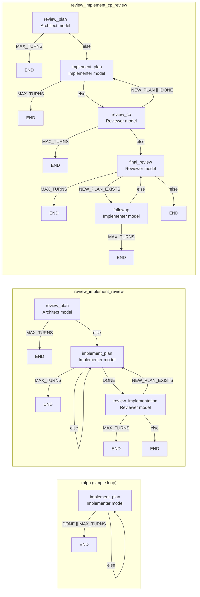

# agent flow

`aflow` runs plan-driven coding workflows through existing agent CLIs such as Codex, Claude, Gemini, Kiro, OpenCode, and Pi.

It does not call provider APIs directly. It shells out to the harnesses you already use. The main use case is a stricter loop where a stronger model plans or reviews, a fast cheap model implements the current checkpoint, and the run keeps moving until the original plan is done or reaches `END`.

## Why?

I kept wanting two things. First, a clean, repeatable way to make a detailed plan with a capable model, implement the current checkpoint with a fast cheap model, review it, and sometimes improve the plan again with a stronger model. I was doing that manually, so I wanted to automate it.

Second, I don't want to stick to a single provider harness. The best value keeps changing, and a lot of free or included usage is tied to the provider CLI, not an API budget. `aflow` is a reliable wrapper for that workflow.


## Install

Requires Python `3.11+`.

Install with `uv`:

```bash
uv tool install git+https://github.com/evrenesat/agent_flow.git
```

That exposes the `aflow` command on your `PATH`.

If you are working from a local checkout, you can also run:

```bash
uv run python -m aflow run path/to/plan.md
```

## Install Skills

`aflow install-skills` copies the six bundled skills into harness skill directories. In auto mode, it only targets supported harness CLIs that are already on `PATH`.

Auto mode:

```bash
aflow install-skills
```

Manual mode:

```bash
aflow install-skills ~/.claude/skills
```

The auto-install destination map is:

- `codex` -> `~/.agents/skills`
- `copilot` -> `~/.agents/skills`
- `gemini` -> `~/.agents/skills`
- `pi` -> `~/.agents/skills`
- `kiro` -> `~/.kiro/skills`
- `opencode` -> `~/.config/opencode/skills`
- `claude` -> `~/.claude/skills`

## Usage

```bash
aflow run path/to/plan.md
aflow run --start-step implement_plan path/to/plan.md
aflow run review_implement_review path/to/plan.md
aflow run --team 7teen path/to/plan.md
aflow run -mt 10 path/to/plan.md
aflow run path/to/plan.md -- keep edits small and update docs if behavior changes
```

If the workflow name is omitted, `aflow` uses `aflow.default_workflow` from config.
`--team` selects a team for the run, and it overrides any team set in the workflow config.
`--max-turns` / `-mt` overrides `[aflow].max_turns` for that run.

`--start-step` names a workflow step, not a plan checkpoint.

If you omit `--start-step` and the plan is partly complete, `aflow` prompts you to pick a step when the workflow has more than one step. That prompt is interactive only.

If that prompt or the startup recovery prompt would be needed and stdin/stdout are not TTYs, `aflow` exits with a clear error instead of guessing.

If startup hits an `inconsistent_checkpoint_state` parse error, `aflow` asks whether to recover and resume from the affected checkpoint using the same retry path it uses for in-run retries. That recovery prompt is interactive only too.

If you pass `--start-step` on a plan that is already complete, `aflow` exits with a clear error instead of ignoring the flag.


## Plan Format

`aflow` reads a Markdown plan from disk and derives progress from checkpoint headings plus unchecked task items inside each checkpoint.

Minimal example:

```md
# Plan

### [ ] Checkpoint 1: Wire The CLI
- [ ] add the command entrypoint
- [ ] cover it with tests

### [ ] Checkpoint 2: Update Docs
- [ ] document the final behavior
```

Current parser rules:

- Checkpoint headings must start with `### [ ] Checkpoint ...` or `### [x] Checkpoint ...`.
- Only task items under a checkpoint section count toward that checkpoint's remaining work.
- A checked checkpoint heading cannot contain unchecked task items.
- If no checkpoint sections are found, the run fails before starting.

## First Run

`aflow` reads `~/.config/aflow/aflow.toml`.

If those files do not exist, `aflow` copies the packaged `aflow/aflow.toml` and sibling `aflow/workflows.toml` into place, prints both paths, and exits. That happens even if you run bare `aflow` with no subcommand, so you can open the files and edit them before the first real run.

Example:

```bash
aflow run path/to/plan.md
# Config bootstrapped at ~/.config/aflow/aflow.toml
# Review the copied config files and adjust them if needed, then run again
```

## Config

Config is split across two TOML files:

- `aflow.toml` for global settings, harness profiles, role mappings, team overrides, and prompt templates
- `workflows.toml` for workflow definitions and workflow aliases

### `[aflow]` options

| Key | Type | Default | Description |
|-----|------|---------|-------------|
| `default_workflow` | string | — | Workflow to run when none is specified on the CLI. |
| `keep_runs` | int | `20` | Number of run log directories to retain under `.aflow/runs/`. Older directories are pruned automatically after each run. |
| `max_turns` | int | `15` | Hard cap on turns for a run. `--max-turns` / `-mt` overrides it for that invocation only. |
| `retry_inconsistent_checkpoint_state` | int | `0` | How many times to automatically retry the same workflow step when the harness exits cleanly but leaves the plan in an inconsistent checkpoint state (a checkpoint heading marked complete with unchecked steps still present). `0` disables retries. Each retry consumes one normal turn and appends the exact parse error to the prompt. |
| `banner_files_limit` | int | `10` | Maximum number of changed files to show in the live banner before it appends `+N more`. |
| `max_same_step_turns` | int | `5` | Maximum number of consecutive turns the same workflow step can be selected before the run fails. Applies only to multi-step workflows. `0` disables the guardrail. |

Each workflow can also set `retry_inconsistent_checkpoint_state` directly in its own table to override the global default for that workflow.

Example:

```toml
# aflow.toml
[aflow]
default_workflow = "ralph"
keep_runs = 10
max_turns = 12
retry_inconsistent_checkpoint_state = 1

[harness.codex.profiles.high]
model = "gpt-5.4"
effort = "high"

[roles]
architect = "codex.high"
worker = "codex.high"
reviewer = "codex.high"
senior_architect = "codex.high"

[teams.7teen]
worker = "codex.nano"

[prompts]
simple_implementation = "Work from {ACTIVE_PLAN_PATH}. Use 'aflow-execute-plan' skill."
```

```toml
# workflows.toml
[workflow.ralph.steps.implement_plan]
role = "worker"
prompts = ["simple_implementation"]
go = [
  { to = "END", when = "DONE || MAX_TURNS_REACHED" },
  { to = "implement_plan" },
]

[workflow.ralph_jr]
extends = "ralph"
team = "7teen"
```

Config rules that matter in practice:

- A step `role` names a key from `[roles]`.
- `harness.<name>.profiles.<profile>` tables set `model` and optional `effort`.
- Global roles map to fully qualified `harness.profile` selectors.
- Team tables override a subset of global roles, and any missing role falls back to `[roles]`.
- `workflows.toml` holds concrete workflows, and `[workflow.<name>]` can use `extends` plus an optional `team` override for aliases.
- Concrete workflows start at the first declared step in `workflow.<name>.steps`.
- `prompts` must be a non-empty array of prompt keys.
- Prompt values can be inline text or `file://` paths in three forms: absolute (`file:///...`), config-relative (`file://path/to/file.txt`), or cwd-relative (`file://./path/to/file.txt`).
- `go` transitions are checked in declaration order. First match wins.
- Supported condition symbols are `DONE`, `NEW_PLAN_EXISTS`, and `MAX_TURNS_REACHED`.
- Boolean expressions support `&&`, `||`, `!`, and parentheses.
- A transition without `when` is an unconditional fallback.

Condition symbols mean exactly this at transition-evaluation time:

- `DONE` is true when the original user-supplied plan file is complete after the current step finishes. It is based on `ORIGINAL_PLAN_PATH`, not on any generated follow-up plan.
- `NEW_PLAN_EXISTS` is true when the current step actually created the generated candidate file for this turn at `NEW_PLAN_PATH`.
- `MAX_TURNS_REACHED` is true only on the last allowed turn, when the current turn number is equal to the configured `max_turns`.

Prompt templates support these placeholders:

- `{ORIGINAL_PLAN_PATH}`
- `{ACTIVE_PLAN_PATH}`
- `{NEW_PLAN_PATH}`

Those placeholders belong in workflow prompt templates. The bundled skills under `aflow/bundled_skills/` are static guidance files that a harness can inject around those prompts, not places to author unresolved workflow variables.

## How A Run Works

Each workflow step launches one fresh harness process.

At a high level:

1. `aflow` loads the selected workflow and reads the original plan file.
2. It starts at the workflow's first declared step.
3. It renders the step prompts, resolves the step role through the selected team and global `[roles]` map, and runs the harness CLI once for that step.
4. After the harness returns, it re-reads the original plan file and evaluates the step's `go` transitions.
5. The next matching transition decides whether to continue with another step or stop at `END`.

Plan-path behavior is strict:

- `ORIGINAL_PLAN_PATH` is always the user-supplied plan file.
- `DONE` is computed from `ORIGINAL_PLAN_PATH`, not from a generated follow-up plan.
- `NEW_PLAN_PATH` is generated once per turn with the format `<stem>-cpNN-vNN.<suffix>`.
- `ACTIVE_PLAN_PATH` starts as the original plan path.
- `ACTIVE_PLAN_PATH` changes only when the current harness step actually writes `NEW_PLAN_PATH`.
- Before the workflow starts, `aflow` copies the original plan into `<repo_root>/plans/backups/`.
- If the matching backup content already exists, `aflow` reuses it.
- If the same backup name already exists with different content, `aflow` writes the next `_vNN` file instead of overwriting anything.

Extra CLI instructions after the plan path are appended to the rendered step prompt.

## Loop Limits

`max_turns` from `[aflow]` is the primary hard cap on turn count. The workflow runner executes turns with a fixed `1..max_turns` loop, so a workflow cannot exceed that number of turns even if its `go` transitions keep routing back to earlier steps.

That hard cap does not end the run by itself in the success path. On the last allowed turn:

- `MAX_TURNS_REACHED` evaluates true for transition matching.
- If one of that step's transitions matches and routes to `END`, the run completes successfully with end reason `max_turns_reached` unless `DONE` is also true, in which case the end reason is `done`.
- If no transition routes to `END` before the loop exhausts, the run fails with "reached max turns limit ... without a transition to END".

Other things can stop a run earlier, but they are not extra turn-limit mechanisms:

- the plan is already complete before any turn starts
- a step transitions to `END`
- no `go` transition matches for the current step
- the harness exits non-zero
- the original plan becomes unreadable or invalid
- the same-step cap triggers (multi-step workflows only)

For multi-step workflows, `max_same_step_turns` (default `5`) limits how many consecutive turns the same step can be selected. When the same step would be selected for the (limit + 1)-th turn in a row without any other step executing in between, the run fails with a clear message naming the step and the limit. The streak resets only after a different step actually executes. Single-step workflows like `ralph` are not affected by this cap.

## Harnesses

Supported harness adapters are:

- `claude`
- `codex`
- `copilot`
- `gemini`
- `kiro`
- `opencode`
- `pi`

`aflow` expects those CLIs to already be installed and authenticated on the machine. It does not manage provider auth or SDK setup.

Current adapter behavior:

- `codex` uses `codex exec --dangerously-bypass-approvals-and-sandbox`
- `claude` uses `claude -p --permission-mode bypassPermissions --dangerously-skip-permissions`
- `copilot` uses `copilot -p ... -s --allow-all --no-ask-user`
- `gemini` uses `gemini --prompt ... --approval-mode yolo --sandbox=false`
- `kiro` uses `kiro-cli chat --no-interactive --trust-all-tools`
- `opencode` uses `opencode run --format default --dir <repo-root>`
- `pi` uses `pi --print --tools read,bash,edit,write,grep,find,ls`

`effort` is currently passed through only by the `claude`, `codex`, `copilot`, and `pi` adapters.


## Live Status

While a step is running, `aflow` shows a Rich status panel on stderr. The panel refreshes every second so the elapsed timer advances without waiting for a step transition. Git stats refresh every 10 seconds.

Fields shown:

- elapsed time (updates every second)
- workflow and current step
- `Harness/Model` as one line, using `<harness> / <model> / <effort>` when effort exists
- checkpoint progress and turn count
- original and active plan paths, with the follow-up path only shown once the file exists
- a larger workflow graph in the upper-right, with one box per step and `go` arrows between them
- a growing turn-history area that keeps each completed/current turn visible for the whole run
- git summary: modified, added, and deleted file counts since workflow start, net line additions and removals, commits made since start, and up to `[aflow].banner_files_limit` changed file paths (then `+N more`)
- current run status

The changed-file list uses `[aflow].banner_files_limit`, which defaults to `10`.

The banner does not show a speculative follow-up plan path before the file exists. When a review step actually creates the follow-up file, `Active Plan` switches to that file.

The git summary is based on a working-tree snapshot captured at workflow start, so pre-existing dirty state is excluded. If git is unavailable the git rows are omitted and the workflow still runs.

## Dirty Worktree

`aflow run` checks the git working tree before starting. If the worktree is dirty:

- in interactive mode (stdin and stdout are TTYs), it prompts: `Worktree is dirty (M N, A N, D N). Start anyway? [y/N]:`. Enter `y` or `yes` to continue. Any other input exits with code 1.
- in non-interactive mode, it prints an error and exits with code 1.

## Success Reporting

When a workflow finishes successfully, `aflow` prints one line on stdout. The message names the workflow, how many turns ran, and why the run stopped.

The machine-readable `end_reason` values are:

- `already_complete`
- `done`
- `max_turns_reached`
- `transition_end`

`transition_end` covers successful `END` transitions when the plan is still incomplete and the chosen transition is not driven by `DONE` or `MAX_TURNS_REACHED`, including an unconditional `go = [{ to = "END" }]`.

## Run Logs

Each workflow invocation writes structured artifacts under exactly one `.aflow/runs/<run-id>/` directory for the life of that run. Turn-start directories are created inside that directory before the harness launches and finalized in-place after it returns. No sibling run directories are created during step-to-step progression.

Saved data includes:

- turn directories are created at turn start, before the harness process launches
- prompt files, argv, env, and a starting `result.json` stub are written immediately
- rendered prompts
- argv and environment metadata
- stdout and stderr for each step
- plan snapshots before and after each step
- evaluated conditions and the chosen transition
- `end_reason` on successful runs, both in `run.json` and in the final turn artifact
- top-level run metadata such as workflow name, current step, turns completed, plan paths, and the terminal end reason

After the harness exits, `aflow` finalizes the same turn directory in place with stdout, stderr, return code, the post-run snapshot, and the final turn outcome. If a harness crashes after the turn directory is created, the partial turn log is still inspectable.

If a run reaches the hard loop limit without any transition to `END`, that is still a failure, even if the last turn also satisfies `MAX_TURNS_REACHED`.

Older run directories are pruned automatically. The retention count is controlled by `keep_runs` in `[aflow]` config (default: `20`). The default max turn limit is `15` and can be overridden with `--max-turns` / `-mt`.

## Shipped Workflows

The bundled config includes these ready-to-use workflows:

- `ralph` - single-step implementation loop, no review
- `ralph_jr` - `ralph` with the `7teen` team
- `review_implement_review` - review, implement, then review again with `aflow-review-squash`. On approval the reviewer squashes all post-handoff commits into one final commit. This squash behavior is specific to this workflow, not an engine-wide invariant.
- `review_implement_cp_review` - checkpoint-scoped review with `aflow-review-checkpoint` and a final no-squash audit with `aflow-review-final`. Checkpoint commit structure is preserved on approval.
- `hard` - alias for `review_implement_cp_review`
- `jr` - alias for `review_implement_cp_review` with the `7teen` team

## Built-In Workflow Diagrams

These diagrams show the default workflow shapes. The labels use generic role names, not the bundled harness/profile defaults, because most people will swap those models out in their own config.



## Included Skills

This repo also ships optional skills under `aflow/bundled_skills/`. `aflow install-skills` copies them into the harness-specific skill roots listed above.

- `aflow-plan` - static guidance for writing aflow-compatible checkpoint plans
- `aflow-execute-plan` - lightweight reinforcement for executing an active plan, including review-generated non-checkpoint follow-up plans
- `aflow-execute-checkpoint` - checkpoint-scoped execution for the original handoff plan, with support for focused non-checkpoint follow-up plans when review creates one
- `aflow-review-squash` - final review for completed autonomous runs, including whole-handoff squash or fix-plan creation
- `aflow-review-checkpoint` - checkpoint-scoped review for the latest checkpoint attempt
- `aflow-review-final` - no-squash final auditor for checkpoint workflows after the original plan is complete

The workflow config is where the plan-path placeholders belong. The skills themselves stay free of workflow template variables.

## Repository Layout

- `aflow/` - package code
- `aflow/bundled_skills/` - packaged optional workflow skills
- `tests/` - test suite
- `plans/` - example and in-progress plan artifacts
- `pyproject.toml` - package metadata and console entrypoint

## Troubleshooting

- If the harness exits non-zero, `aflow` stops and prints the run log directory.
- If no `go` transition matches, the run fails with the step name and evaluated condition values.
- If the selected workflow does not exist, `aflow` exits before starting a run.
- If the plan format is invalid, the run fails before or after the step that produced the invalid state.
